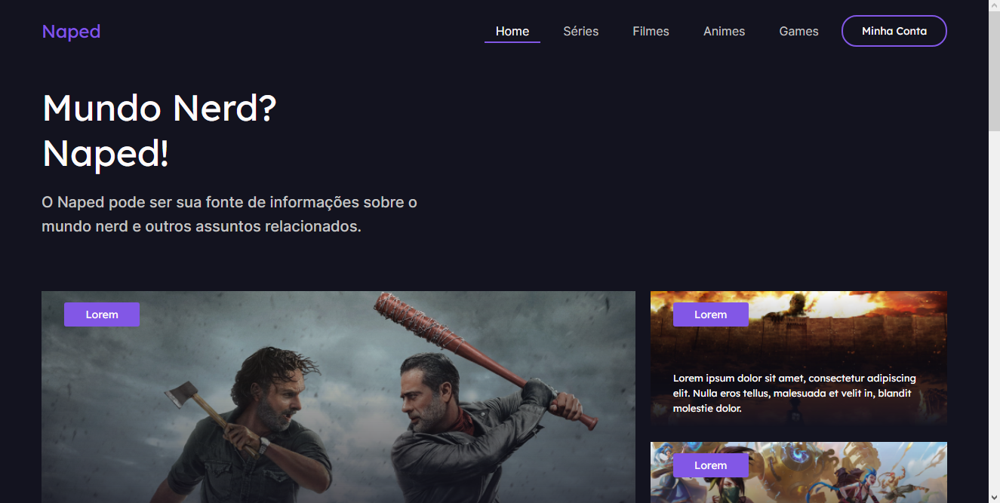

# Naped - Central de Noticias Nerd

## desafio10-codelandia

#### Este é o desafio _10_ da comunidade _Codelândia_ por [iuricode](https://github.com/iuricode)!

<h4 align="center"><a href="https://desafio10-codelandia.vercel.app/">Clique para visitar o projeto</a></h4>

## 🎯 Objetivo

O desafio consiste em desenvolver um página de central de noticias sobre o Mundo Nerd de acordo com o layout disponibilizado no [Figma](https://www.figma.com/file/Yb9IBH56g7T1hdIyZ3BMNO/Desafios---Codelândia?node-id=15409%3A2).

## 📚 Páginas

O site é composto por 4 páginas diferentes:

- **Principal:** Página principal;
- **Animes:** Página contém lista de noticias sobre animes;
- **Noticia:** Notícia sobre o filme Vidas ao Vento;
- **404:** Página não encontrada;

## 🛠️ Tecnologias utilizadas

Para o desenvolvimento deste site utilizei as seguintes tecnologias:

- HTML;
- CSS;
